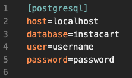

# Metis Data Science Bootcamp | Project 3 | Classification

(in progress)

## Objective

**Predicting whether an InstaCart customer will purchase an item again in the future using Logistic Regression**

By Elliot Wilens, Metis Data Scientist

Timeline: 2 weeks

This project idea stemmed from a Kaggle Competition in 2018. More information can be found at [kaggle.com](https://www.kaggle.com/c/instacart-market-basket-analysis/overview), but here's a brief synopsis:

```
Currently Instacart uses transactional data to develop models that predict which products a user will buy again, try for the first time, or add to their cart next during a session. Recently, Instacart open sourced this data - see their blog post on 3 Million Instacart Orders, Open Sourced.
```

Project instructions (Metis students only) [here](https://github.com/thisismetis/onl_ds5/blob/main/curriculum/project-03/project-03-introduction/project_03.md).

Download the dataset [here](https://www.kaggle.com/c/instacart-market-basket-analysis/data).
___
## Tech Stack

- PostgreSQL
- Python3 Libraries:
    - SQLAlchemy
    - scikit-learn
    - StatsModels
    - pandas & numpy

___
## Steps to Reproduce Locally
1. Fork & clone this repository to your local Github repo/machine
2. Ensure all technologies in the [Tech Stack](#tech-stack) are installed on your machine
3. From your terminal (located in the root directory of the repo), use the `psql -f code/db_create.sql` command to create and populate the 'instacart' database on your machine.
4. Create a `code/database.ini` file containing your PostgreSQL username and password. Make sure this filename remains in the .gitignore file to keep this information hidden from the public. Here's what it should look like (replace 'username' and 'password' with your Postgres username & password).
    
___
## Data Source

**Kaggle Competition (2018): [Instacart Market Basket Analysis](https://www.kaggle.com/c/instacart-market-basket-analysis/data)**

View the data dictionary at the link above.
