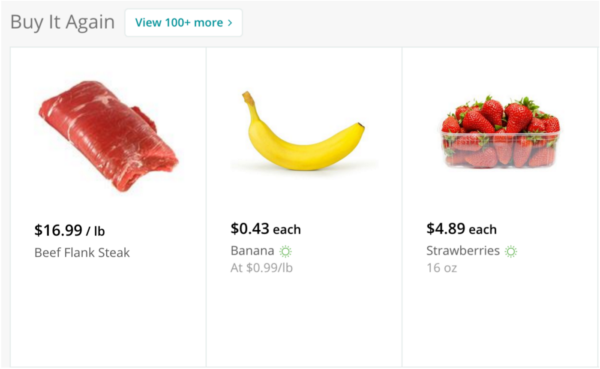
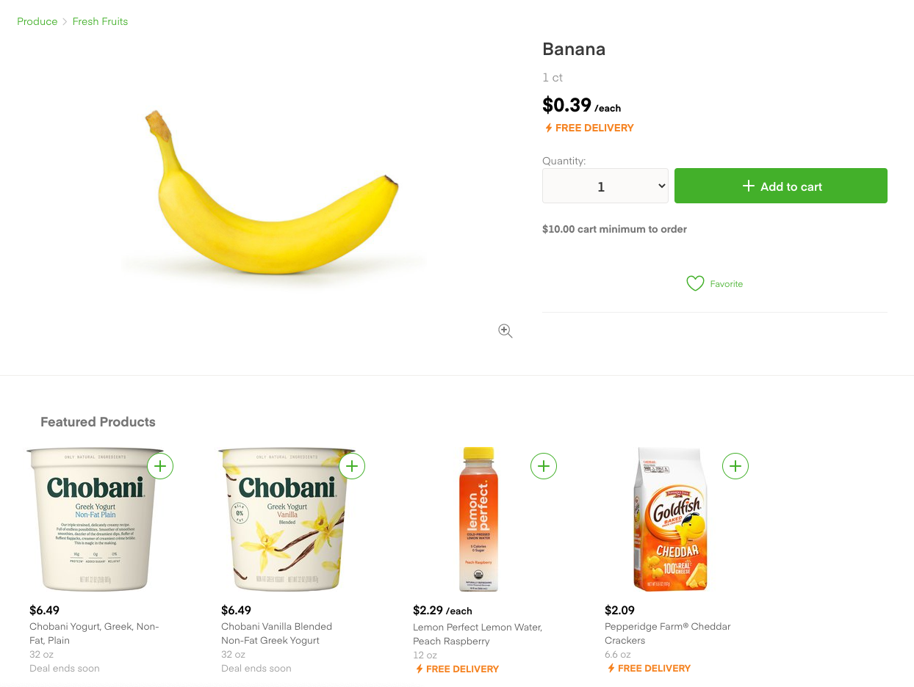

# Metis Data Science Bootcamp | Project 3 | Classification

(in progress)

## Objective

### Identifying which items should be highlighted to the user in Instacart's 'Buy it Again' feature

**By Elliot Wilens, Metis Data Scientist**

Timeline: 2 weeks

This project idea stemmed from a Kaggle Competition in 2018. More information can be found at [kaggle.com](https://www.kaggle.com/c/instacart-market-basket-analysis/overview), but here's a brief synopsis:

*Currently Instacart uses transactional data to develop models that predict which products a user will buy again, try for the first time, or add to their cart next during a session.*

DISCLAIMER: I am in no way affiliated with Instacart and did not make any Kaggle submissions, since the competition ended a couple years ago.

Project instructions (Metis students only) [here](https://github.com/thisismetis/onl_ds5/blob/main/curriculum/project-03/project-03-introduction/project_03.md).

Download the dataset [here](https://www.kaggle.com/c/instacart-market-basket-analysis/data).

Data dictionary [here](https://gist.github.com/jeremystan/c3b39d947d9b88b3ccff3147dbcf6c6b).

___
## Applications

This model has two use-cases for Instacart:

1.  **"Buy it again" recommendations in the application**

    

2.  **"Frequently bought with..." recommendations while shopping for certain products**

    

These are important to keep in mind, as my focus for the project is to help Instacart maximize conversion rates with these features. 
___
## Tech Stack

- PostgreSQL
- Google Cloud Platform VM (Serving Jupyter Notebook & Database in compute engine)
  - not required for local reproduction
  - two VMs used:
    - for analysis & feature engineering
      - machine type: N2 10vCPU, 64GB memory 
    - for training models & parameter optimization (grid search CV)
      - machine type: N2, 16 vCPU, 64GB memory 
- Tableau for EDA (Exploratory Data Analysis)
- FileZilla (to move files too large for Git to/from GCP VM)
- Python3 Libraries:
    - pyscopg2
    - scikit-learn
    - StatsModels
    - multiprocessing
    - pickle
    - pandas & numpy
    - matplotlib & seaborn

- Classification Algorithms:
    - RandomForest
	- XGBoost
	- Logistic Regression
- Modeling techniques
  - Grid Search for parameter optimization
  - K-Fold (5) cross-validation for model comparison
  - Precision/Recall curves for probability threshold determination
  - Confusion matrices to evaluate metrics and K-Fold
  - F-beta (beta=2) scoring instead of F-1 due to class imbalance and prioritization of recall
___
## Steps to Reproduce Locally
1. Fork & clone this repository to your local Github repo/machine
2. Ensure all technologies in the [Tech Stack](#tech-stack) section are installed on your machine
3. From your terminal (located in the root directory of the repo), use the `psql -f code/db_create.sql` command to create and populate the 'instacart' database on your machine.
4. Create an empty directory named `pickle` within the `metis-project3/code/` directory.
5. Create an empty directory named `models` within the same directory as above
6. Create a `code/database.ini` file containing your Postgres username and password. Make sure this filename remains in the .gitignore file to keep this information hidden from the public. Here's what it should look like (replace 'username' and 'password' with your Postgres username & password).

    

___
## Feature Engineering

I looked at Kaggle-winning projects to get an idea of what features did and did not work. Thank you Kaggle!

There are three different types of features that I used:
* product features
    * total unit sales
    * total unit reorders
    * unit reorder percentage
* user features
  * average order size
  * average time between orders
  * time since last order
  * last cart
* **user_product features**
  * streak
    * how many times in a row did the user purchase this product?
    * also captures 'negative streaks'
      * example: if user *x* purchased product *y* three orders ago, but has not purcased since, streak = -2
  * last five purchases
    * of User *x*'s last five orders, how many times did they buy product *y*?
  * last five purchase ratio
    * the above value divided by 5
    * thank you to [Kazuki Onodera](https://medium.com/kaggle-blog/instacart-market-basket-analysis-feda2700cded) for finding this. Without it, the 'last five purchases' feature did not yield much predictive value for the model

There were 32 features in total. The above are the ones that provided the most impact on the model (based on F-2 scores from running the model with & without them)

___
## Model Selection

I compared results between Logistic Regression, RandomForest, and XGBoost. The tree-based models (RF & XGB) performed much better than standard Logistic Regression. The RandomForest and XGBoost results were very close, but XGBoost had the slight edge in terms of F-1 score.

___
## Parameter Tuning XGBoost

Before we get into this, I want to note that I ran my grid searches on a 16-vCPU virtual machine, and my initial search took about 28 hours at 1600% CPU utilization, on about 25% of my data. I suggest using a subset closer to 1% of the data unless you're using a high-CPU VM.

The parameter ranges were as follows:

    params = {
        'learning_rate': [0.001, 0.001, 0.01]
        'max_depth': [7, 8, 9],
        'n_estimators': [400, 500],
        'colsample_bytree': [0.6, 0.7, 0.8],
        'min_child_weight': [7, 8, 9]}

I then ran it with a few more variations above the above parameters, each time lowering the slope (and subset, due to time constraints).

Here were the final parameters I used for the XGBoostClassifier():

    xgb = XGBClassifier(colsample_bytree=0.8,
                    min_child_weight=9,
                    n_estimators=400,
                    max_depth=7,
                    learning_rate=0.009,
                    eval_metric='logloss',
                    verbosity=3,
                    use_label_encoder =False)
___
## Model Evaluation

Let's refer back to our use-case. Specifically, Instacart's "Buy it Again" feature. The feature brings Instacart two benefits:
1. User ease of use
2. **Increase product conversion rates**

What does that mean for us, with our goal being number 2? What products should Instacart show their users in the "Buy it Again" section to increase conversion? 
* Optimize precision: only show the users the products that we're certain they'll purchase
  * *precision = true positives / all positive predictions*
* Optimize recall: show orders we're certain they'll purchase (for convenience), but also show items that they are reasonably less-likely to purchase
  * *recall = true positives / actual positives*

The clear winner is the latter option, to optimize recall. However, the Kaggle competition ranked winners based on their model F-1 scores. F-1 scores perfectly balance precision with recall.

Therefore, here is where we diverge from the Kaggle competition (and hopefully Instacart does the same). We will use an F-beta scoring metric with beta=2. This F-2 score still balances precision and recall, but essentially weights recall 25% higher in the calculation.

We also need to set a probability threshold. If our model were a person, this would be the amount of convincing they would need to classify something as a reorder. With a 50% threshold, if the model predicts a 40% probability, it will not be shown to the user. 

So, I tested the results at each threshold to determine that a threshold of 0.12 results in the highest F-2 score. With this, we have our prediction model, and the results are as follows:

**F-2 Score: `0.532034`**

___
## Data Source

**Kaggle Competition (2018): [Instacart Market Basket Analysis](https://www.kaggle.com/c/instacart-market-basket-analysis/data)**

Data originally sourced from “The Instacart Online Grocery Shopping Dataset 2017”, Accessed by Kaggle from [instacart.com](https://www.instacart.com/datasets/grocery-shopping-2017)
